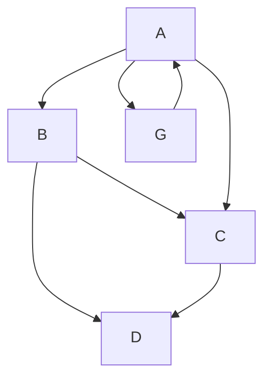
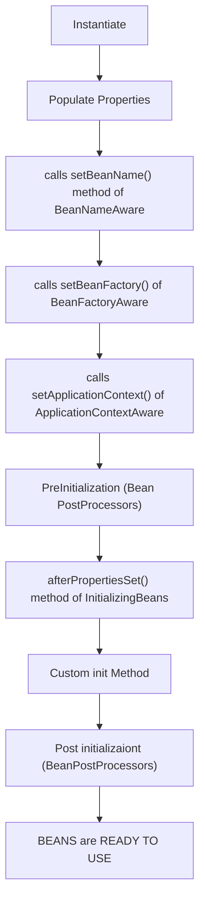
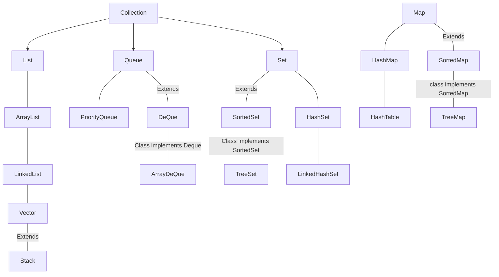

# mermaid

## Example 1

```mermaid
graph TD;
  A-->B; A-->G; G-->A; B-->C
  A-->C;
  B-->D;
  C-->D;
```
## Example 2

```mermaid
  graph TD;
  A["Instantiate"] --> B["Populate Properties"];
  B["Populate Properties"] --> C["calls setBeanName() method of BeanNameAware"];
  C["calls setBeanName() method of BeanNameAware"] --> D["calls setBeanFactory() of BeanFactoryAware"];
  D["calls setBeanFactory() of BeanFactoryAware"] --> E["calls setApplicationContext() of ApplicationContextAware"];
  E["calls setApplicationContext() of ApplicationContextAware"] --> F["PreInitialization (Bean PostProcessors)"];
  F["PreInitialization (Bean PostProcessors)"] --> G["afterPropertiesSet() method of InitializingBeans"];
  G["afterPropertiesSet() method of InitializingBeans"] --> H["Custom init Method"];
  H["Custom init Method"]-->I["Post initializaiont (BeanPostProcessors)"];
  I["Post initializaiont (BeanPostProcessors)"] --> J["BEANS are READY TO USE"];
```
# Example 3

```mermaid
    graph TD
    Collection --> List

    List --- ArrayList
    ArrayList --- LinkedList
    LinkedList --- Vector
    Vector -- Extends --- Stack

    Collection --> Queue
    Queue --- PriorityQueue
    Queue -- Extends --- DeQue
    DeQue -- "Class implements Deque"--- ArrayDeQue

    Collection --> Set
    Set -- Extends --- SortedSet
    SortedSet -- "Class implements SortedSet"--- TreeSet
    Set --- HashSet
    HashSet --- LinkedHashSet

    Map --- HashMap
    HashMap --- HashTable
    Map -- Extends --- SortedMap
    SortedMap -- "class implements SortedMap" --- TreeMap
```
